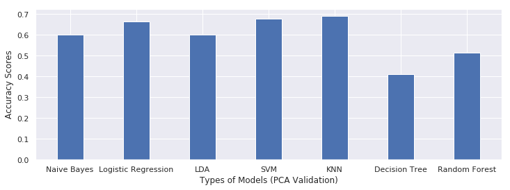
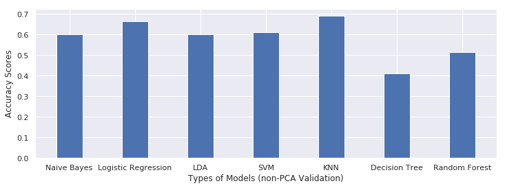
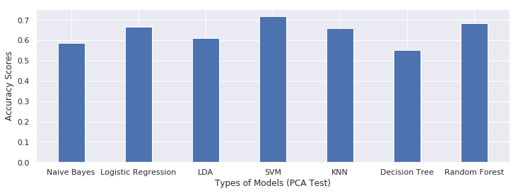
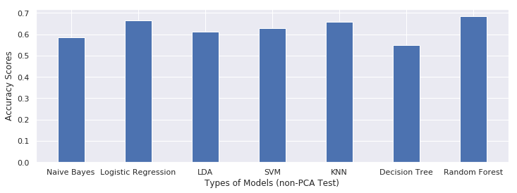

# Steel-Plate-Failure-Prediction
Prediction of steel faults based on different attributes and parameters

## Objective:
The objective of the project is to classify the different types of steel faults based on different attributes and parameters. The end goal is to predict the fault type by training the model with different machine learning algorithms.In doing so I have applied to use two approaches- **Supervised learning** and **unsupervised learning**.
In **Supervised** learning I trained the model with the training data along with their corresponding output(well labelled).
Used different algorithms below to analyse how they perform compared to one other.I have employed **Gaussian Naïve Bayes Classifier**,**Logistic Regression**,**SVM**,**LDA**,**KNN**,**DECISION TREE**,**Random Forest**.I have used **PCA** for reducing the features and applied **K Means** as an expample of **unsupervised learning**.
Finally, I  compare the models and see how well each model perform using Classification metrics: Confusion Matrix, Precision, Recall and F-1 Score in **validation set** and **Test set**

## Motivation:
A fault may be defined as an unacceptable difference of at least one characteristic property or attribute of a system from acceptable usual typical performance. The main purpose of any fault diagnosis system is to determine the location and occurrence time of possible faults on the basis of accessible data and knowledge about the performance of diagnosed processes. Manual fault diagnosis system is the traditional way where an expert with electronic meter tries to obtain some information about relevant operational equipment, check the maintenance manual and then diagnose the probable causes of a particular fault. However, intelligent fault diagnosis techniques can provide quick and correct systems that help to keep product quality problems at bay and facilitates precautionary maintenance.
This project evaluates the performances of several popular and effective data mining models to diagnose seven commonly occurring faults of the steel plate namely; Pastry, Z_Scratch, K_Scatch, Stains, Dirtiness, Bumps and Other_Faults.

## WorkFlow:
1. **Exploratory Data Analysis**
    1.1: Import the data and checked the shape of the data and divided the data into training se, validation set and test set in (60:20:20 ratio)
    1.2: Checked for the null value which can be replaced by mean or mode.
    1.3: Count plot with histogram visualization to show the number of defects belong to each defect.
    1.4: Converted 'Type of steel' into one column as it looks like they are complementory
    1.5: Converted one hot encoding of all the 7 types of faults into single column 'label'[label code]
    1.6: Visual analysis of the correlation between the factors.
    1.7: Dimension reduced from 1941*34 to 1941* 27 
 2. **Feature Selection**
    2.1: standarisation of the feature datasets
    2.2: Principal Component analysis(PCA) to reduce the number of features and PCA( with help of elbow method) it shows to take 11 components(features) which achieve 98% variance in it.
 3. **Model Development and Classification**
    3.1: Gaussian Naïve Bayes Classifier,
    3.2: Logistic Regression,
    3.3: SVM,
    3.4: LDA,
    3.5: KNN
    3.6: DECISION TREE
    3.7: Random Forest
    
## RESULTS: COMPARING MODELS
**Validation Sets**

**Test Sets**

## CONCLUSION:
We can see from the above, that KMeans Algorithm does not give a very good result. As it
is an unsupervised algorithm, it did not make use of the true labels. The model itself
calculated that there should be 3-4 distinct clusters, whereas according to the true labels, we
know there are 7 fault types. For this reason, KMeans model is unacceptable for this
dataset.

On the other hand, the Supervised models did a much better job. As can be see from their
comparison, the test dataset without PCA applied on them, gave best results with Random
Forest algorithm. This is quite expected, as Random Forest is an ensemble algorithm using
a combination of other algorithms (Decision trees in this case).
For the PCA applied test dataset, Random Forest once again gives a good result.

